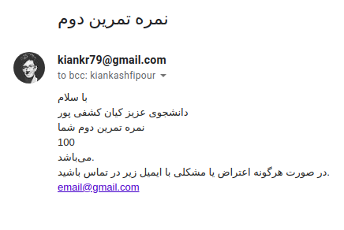
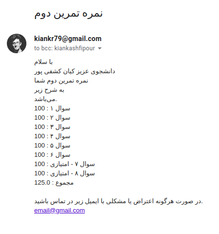

# Harpocrates :speak_no_evil:

> The god of silence, secrets and confidentiality

[](https://cloud.drone.io/aut-ce/harpocrates)

## Introduction

This is a python code to send each student's grade privately using
`smtplib` to send emails from python and `csv` to deal with csv file
of grades and students' names.

## Send Grades

As you can see in [sample.csv](sample.csv) you should have a sheet like
this (if your column names are different feel free to change them in code):

```python
FIRST_NAME_COLUMN = "نام"
LAST_NAME_COLUMN = "نام خانوادگی"
STUDENT_ID_COLUMN = "شماره دانشجویی"
EMAIL_COLUMN = "ایمیل"
NOTE_COLUMN = "توضیحات"
SKIPPED_ROWS = 2
```

then you can fill [subject.txt](subject.txt) and [body.html](body.html) with the text that
you want yo send as your email subject and its body. e.g.

```html
<html>
  <body dir="rtl">
    <p>
      با سلام<br />
      دانشجوی عزیز {{ name }}<br />
      نمره تمرین شما
    </p>
    <table>
      <tbody>
        
        <tr>
          <td>{{ name }}</td>
          <td>{{ grade }}</td>
        </tr>
        
      </tbody>
    </table>
    <p>
      در صورت هرگونه اعتراض یا مشکلی با ایمیل زیر در تماس باشید.<br />

      <a href="mailto:parham.alvani@gmail.com">Pahram Alvani</a>
    </p>
  </body>
</html>
```

As you can see, this is a jinja template and you have variables that is set for each student.
Please note that you can check the emails before actually sending them with `--dry-run` flag.

## Enter SMTP/Email Address

After fixing sheets and changing txt files run the program and enter your smtp address
and after that your email address and its password in configuration file. e.g.

```yml
---
email:
  server: smtp.gmail.com
  username: parham.alvani@gmail.com
  password: secret
```

Note that if you use gmail you must go to your google account and change
_Less secure app access_ [here](https://myaccount.google.com/lesssecureapps) by turning on
_Allow less secure apps_. Otherwise you need to use [application-specific passwords](https://support.google.com/accounts/answer/185833?hl=en).

## Installation

You just need to install pandas using [pip](https://pip.pypa.io/en/stable/) to run this program.

```bash
pip install .
python3 harpocrates
```

## Examples

Here you can see some examples of emails I sent from sample csv files:




